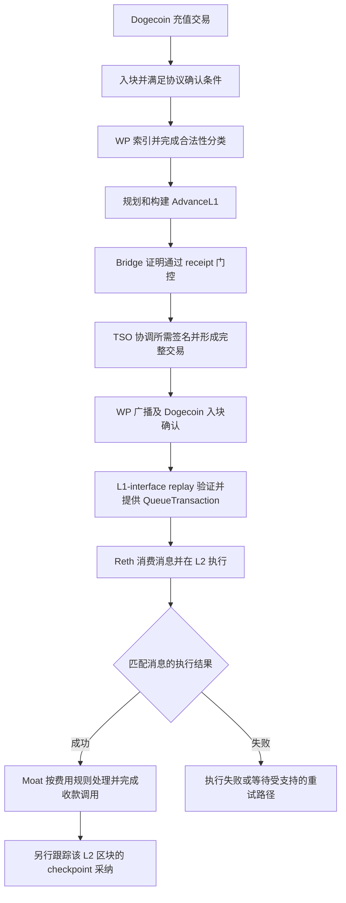
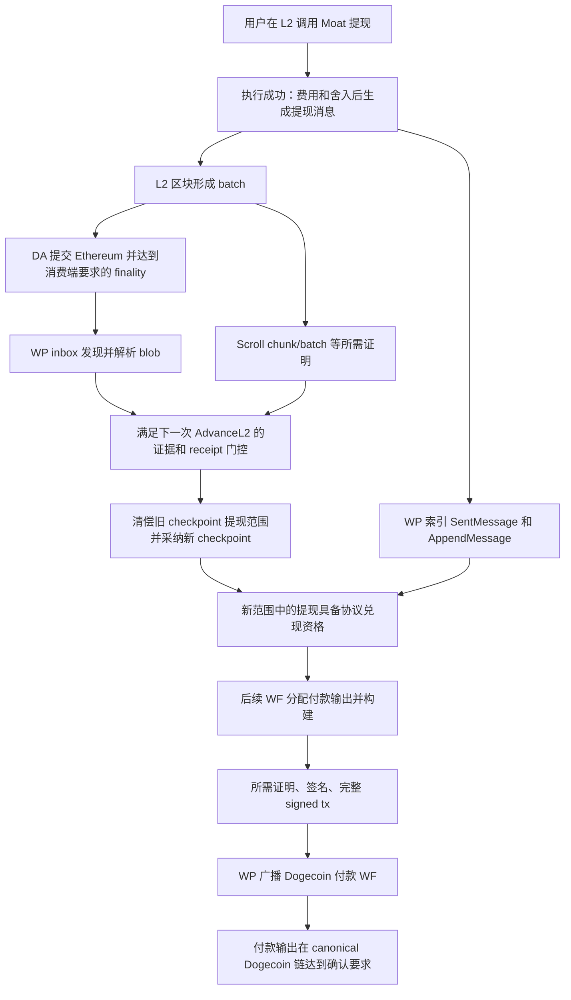
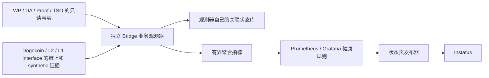

# 充值、提现业务流程与健康判断设计

日期：2026-09-29。状态：历史设计草案，尚未实现或部署。

本文保留当时的业务流程分析和待评审建议，不代表已批准的最终架构。后续讨论提出
sidecar 与 GraphQL 等方案，最终接口和部署形态仍需另行评审。本文的源码基线
固定在 beta.5b，实施前需按目标版本重新核对。

## 1. 分析基线和结论

本稿以 2026-09-29 分析时部署的 dogeos-core `v0.3.0-beta.5b`，提交
`3983679d5cc10a515c5491ade8a0f0fbfe6b7dfb` 为主要依据；Reth 使用
dogeos-rollup-node `v0.3.0-beta.1c`，提交
`d3260afef9ae729a073fd70a43ae4f3832b482f7`。

分析时，`/mnt/wsl/data/dogeos-core` 是 `test/blackbox-shadowfork-stress-limits`
分支，HEAD 为 `fda3e99a7ab512b1f90ab576113cef4e469337a5`，与部署版本分叉。
不能把该工作区有更新，理解为它包含线上版本的全部业务实现。本稿主要读取
`/mnt/wsl/data/dogeos-beta5-real-prep/core` 中与线上匹配的源码。

合约行为另核对本地 scroll-contracts 提交
`dd1747862ee11e5feab45ca76c462957fb0d8bfa`。部署配置指定
`deploy-dogeos-v0.3.0-rc.2`。本次没有证明该镜像、部署产物与这份源码逐字节匹配；
实现前需要核对部署 ABI、代理实现地址和字节码。这是合约适配器的验收前置条件。

结论：

1. Deposits 和 Withdrawals 是跨服务业务结果，不能由 WP 单个队列指标独立代表。
2. WP 应导出它拥有的业务事实；独立观测器关联链上结果和各服务证据；监控系统应用服务目标与发布规则。
3. 充值与提现分别建模。充值的 L2 执行、提现的 L2 checkpoint 采纳与 Dogecoin 付款不能混为一谈。
4. 明确区分业务受影响、正常协议等待、观测不足。健康查询失败不是充值或提现失败的直接证据。
5. 单笔明细保存在观测器的持久存储中；Prometheus 只保存有界维度的聚合指标。

## 2. 源码证据索引

以下 C 路径均位于 core 提交 `3983679d5`；S 路径位于上述合约提交。

| 编号 | 源码位置 | 确认的事实 |
| --- | --- | --- |
| C1 | `docs/protocol/00-dogeos-overview.md`；`crates/indexer_dogecoin/SPEC.md` | 充值合法性、确认与索引；Bridge 地址轮换；只认每笔交易首个满足条件的 Bridge 输出 |
| C2 | `crates/withdrawal_processor/src/wf_build_pipeline/service/planning.rs`，`plan_next_advance_l1`、`allocate_withdrawal_plan` | AdvanceL1 规划、部分区块扫描、提现只能从已采纳范围分配 |
| C3 | 同文件 `plan_next_advance_l2_with_rpc`、`ensure_advance_l2_scroll_batch_ready` | DA 范围、L2 执行一致性、Scroll receipt 门控、旧提现范围必须闭合 |
| C4 | `crates/withdrawal_processor/src/wf_build_pipeline/service/execution/dispatch.rs`，Bridge-state proof gate | WF 在 Built 阶段等待验证 receipt，然后才交给 TSO |
| C5 | `crates/withdrawal_processor/SPEC.md`；`docs/engineering/wftx-lifecycle-measurement.md` | TSO handoff、签名、广播、replay；无签名 txid 与最终 signed txid 不同；现有 WF timeline |
| C6 | `crates/l1_interface/src/replay_read/event_plane.rs` | synthetic block 号与 WF 关联；AdvanceL1 提供 QueueTransaction；AdvanceL2 提供 CommitBatch/FinalizeBatch；只读 canonical replay |
| C7 | `crates/eth_da_submitter/README.md`；`crates/withdrawal_processor/src/eth_da_inbox_worker.rs` | DA 发布端与消费端分离；Ethereum inbox 是 EOA，type-3 交易携带 calldata 和 blobs |
| C8 | `crates/indexer_dogeos/src/indexer.rs`，`build_withdrawal_rows` | 关联 SentMessage 与 AppendMessage，保留区块哈希、tx hash、log index、queue index、目标类型和净额 |
| C9 | `crates/dogeos_protocol/src/transition/common.rs`；`variant.rs::build_advance_l2_patch` | 先执行本次 WF 的 common fulfillment，再检查旧 checkpoint 提现前沿与 root 相等，最后采纳新 checkpoint |
| C10 | `crates/withdrawal_processor/src/public_health_metrics.rs` 和 `public_health_metrics/store.rs` | 当前快照的实际范围、RPC 硬依赖、数据一致性检查和充值提现耦合 |
| C11 | `crates/withdrawal_processor/src/health.rs::readiness_from_state` | K8s readiness 主要是数据库及 L2 ingestion 就绪，不能当作端到端业务健康 |
| C12 | `e2e/blackbox/src/flows.ts`；`src/tests/withdrawal.test.ts` | 现有黑盒测试以专用地址余额、准确付款金额和脚本验证用户结果 |
| S1 | `src/dogeos/Moat.sol::handleL1Message`、`_processWithdrawal` | 充值费用、目标调用失败；提现费用、satoshi 舍入、最小金额、P2PKH/P2SH |
| S2 | `src/L2/L2ScrollMessenger.sol::_executeMessage`；`src/dogeos/L2DogeOsMessenger.sol` | RelayedMessage 与 FailedRelayedMessage；提现只允许 Moat 和规范信封 |

关键固定版本链接：

- [协议流程总览](https://github.com/DogeOS69/dogeos-core/blob/3983679d5cc10a515c5491ade8a0f0fbfe6b7dfb/docs/protocol/00-dogeos-overview.md)
- [WP 规划与提现分配实现](https://github.com/DogeOS69/dogeos-core/blob/3983679d5cc10a515c5491ade8a0f0fbfe6b7dfb/crates/withdrawal_processor/src/wf_build_pipeline/service/planning.rs)
- [AdvanceL2 协议检查](https://github.com/DogeOS69/dogeos-core/blob/3983679d5cc10a515c5491ade8a0f0fbfe6b7dfb/crates/dogeos_protocol/src/transition/variant.rs)
- [L1-interface 事件投影实现](https://github.com/DogeOS69/dogeos-core/blob/3983679d5cc10a515c5491ade8a0f0fbfe6b7dfb/crates/l1_interface/src/replay_read/event_plane.rs)
- [已有 WF 生命周期读取模型](https://github.com/DogeOS69/dogeos-core/blob/3983679d5cc10a515c5491ade8a0f0fbfe6b7dfb/docs/engineering/wftx-lifecycle-measurement.md)
- [当前 WP 健康快照实现](https://github.com/DogeOS69/dogeos-core/blob/3983679d5cc10a515c5491ade8a0f0fbfe6b7dfb/crates/withdrawal_processor/src/public_health_metrics.rs)
- [Moat 源码基线](https://github.com/DogeOS69/scroll-contracts/blob/dd1747862ee11e5feab45ca76c462957fb0d8bfa/src/dogeos/Moat.sol)
- [Messenger 成功与失败事件](https://github.com/DogeOS69/scroll-contracts/blob/dd1747862ee11e5feab45ca76c462957fb0d8bfa/src/L2/L2ScrollMessenger.sol)

## 3. 充值流程

### 3.1 阶段事实和完成条件

| 阶段 | 成功证据 | 不能替代它的信号 |
| --- | --- | --- |
| 充值被链接受 | Dogecoin canonical block 中的交易，匹配当时有效的 Bridge 地址和合法 OP_RETURN、金额、输出选择规则 | 仅有用户广播回执或地址收到钱 |
| 已符合协议处理条件 | 达到当前 indexer/protocol 的确认边界；源码使用 `tip - confirmations` 覆盖规则，应直接复用规则，避免 confirmations 的 off-by-one | 给所有网络硬编码“1 个确认” |
| WP 已发现 | 该笔 canonical 充值被正确分类，索引覆盖达到其所在块 | WP Pod Ready、没有 Pending 行 |
| 已承诺到充值队列 | canonical AdvanceL1 包含该充值，产生确定的 deposit index 和消息内容 | 创建了计划、取到了签名或广播成功 |
| 对 L2 可见 | L1-interface 已验证到相关 WF，能返回匹配队列消息 | WP 自己 replay 已到同一 WF |
| 已在 L2 执行成功 | 目标区块 canonical；对应 type-0x7e 消息、Messenger 成功结果及 Moat 收款调用匹配 | queue index 增长、RPC 可用、L2 receipt status=1 |
| checkpoint 已采纳 | 后续 canonical AdvanceL2 所采纳范围覆盖该 L2 区块和相应消息边界 | DA submitter 的本地 finalized 状态 |

“到账”与“checkpoint 已采纳”分别展示，不把后者偷偷加入到账时延，也不把尚未采纳的 L2 结果描述为最终不可回退。

### 3.2 合约执行与费用

- Messenger 捕获内部调用失败后可以只发出 `FailedRelayedMessage`。外层 receipt 成功不足以证明收款成功。
- Moat 会扣充值费用，且当金额被费用全部消耗时，可以成功消费消息但不给目标转款。应报告明确的按规则处理结果，不计为队列堵塞。
- 收款目标可以是合约，可能在回调中转走余额，也可能拒收。不能以普通用户地址的余额差作为唯一到账证据。
- `depositID` 的语义必须依当前 ABI：本次读取的 Moat 保留 bytes32 参数但忽略它，`DepositReceived` 事件也不含 depositID。不得假设事件自带 txid。关联应使用确定的充值消息及 calldata、消息哈希、队列索引和 receipt。
- 一笔有效充值的目标执行失败必须持续留在异常结果中；消息边界前移不能让它从失败统计里消失。具体重试能力要按实际部署版本确认，不能承诺自动重试。

## 4. 提现流程

图中 W8 本身也要经过 WF 的 Bridge 证明、签名、广播与 canonical 验证；它不是一个直接修改数据库的步骤。DA 和 Scroll 证明可能交叠执行，图中是依赖关系，不要求全程严格串行。

### 4.1 重要的两轮关系

令 `F` 为下一笔尚未兑现的提现索引，`A` 为当前已采纳 checkpoint 的提现上界：

- 当前可兑现范围是 `[F, A)`。
- 假设新的 checkpoint 将上界推进到 `B`，采纳它的 AdvanceL2 必须先使旧范围 `[F, A)` 完成，且 fulfilled root 等于旧 withdraw root。
- 新增范围 `[A, B)` 是本次采纳之后才进入兑现资格，不能用同一笔 WF 的 common fulfillment 把新范围也提前付掉。
- 付款可由 AdvanceL1、AdvanceL2、轮换等 WF 类型携带。不能以“没有特定类型的提现交易”作为故障依据。
- 实现支持按已签名的 projected tail 提前规划后继 WF。签名完成、projected 资格和 canonical 资格是不同证据等级；提前规划不代表用户已收到 Dogecoin。

因此要同时衡量：

1. L2 请求成功后，等待打包、DA、证明和 checkpoint 采纳的时间。
2. checkpoint 采纳后，等待付款计划、签名、广播和确认的时间。

当前 public-health withdrawal 指标只覆盖第二段中的协议可兑现队列。DA 或证明卡住时，新提现尚未进入该范围，队列可能为零，但用户仍未收到钱。

### 4.2 最终成功证据

用规范化提现消息匹配实际 WF 的 Dogecoin 输出，包括：

- 该消息的 queue index，以及对应 canonical fulfillment 关系；
- 净额 satoshi，包含 Moat 费用及不足一 satoshi 的舍入规则；
- 目标 P2PKH/P2SH 脚本；
- 最终 signed WF txid 和 vout；
- 付款交易在 canonical Dogecoin 区块中的确认情况。

输出后来被用户花掉，仍然是成功付款。不能用 `gettxout` 当前是否非空作为历史付款是否完成的唯一依据。

同一笔 L2 交易可以发起多笔提现；同一笔 WF 可以支付多笔提现。不能以 tx hash 一对一连接两端，也不能仅按收款地址和相同金额猜测关联。

## 5. 关联数据模型

### 5.1 业务身份

所有对象首先绑定 `protocol_id / instance`、链 ID、genesis/anchor。重建 Bridge 后禁止跨实例拼接旧记录。

- 充值：canonical Dogecoin txid + 所选 Bridge vout；关联 deposit index、消息哈希和 L2 执行标识。记录链分支版本，集中处理 txid 字节序转换。
- 提现：L2 tx hash + log index + canonical block hash；关联 message/queue index、内容哈希、目标脚本、净额。
- WF：job/spec ID、unsigned txid、TSO transaction ID、handoff attempt ID、signed txid、WF number；保留替代/重试关系。
- DA：batch hash/height 和 L2 range；Ethereum tx hash、区块 hash、tx index、blob index、versioned hash；不能仅以 batch height 全局关联。
- Proof：statement/subject identity、工作项及 attempt、被消费端接受的 verification receipt、证明模式。工作进程自报完成不是门控已接受的证据。

证明、签名能力判定须绑定部署声明的策略。real/enforce 部署不能凭 mock 完成记录判定真实证明可用；当前获准使用的 CubeSigner `transport_only` 也不能被描述成 CubeSigner 已验证了远程证明。签名完成与证明验证分别取证，禁止监控系统自行调整模式来恢复健康。

### 5.2 状态不是一个布尔值

每笔业务保存：已观察到的事实集合、当前主要阻塞阶段、证据等级、链分支、首次有效请求时间、首次满足阶段条件时间、阶段完成时间、最后成功观测时间。

- 证明等阶段可能并行，保存多个等待原因；不能把并行耗时相加当总耗时。
- 重试不重置用户请求年龄。被替代的 WF 是新的尝试，仍可关联同一笔用户业务。
- 后续证据能证明更早阶段曾经完成，但不能伪造更早阶段的精确时间或证明每个参与服务健康。
- `missing / stale / error / contradictory / unsupported` 分别记录。终端重组分支标为 orphaned，不能继续计入当前完成数。
- 重组后重新评估受影响后缀，保留历史成功与回退记录。不能把之前成功的业务直接删掉。

## 6. 建议架构

### 6.1 服务侧

服务拥有业务语义，并对外提供稳定、只读、有界的投影接口。观测器不挂载 WP SQLite PVC，不复制生产数据库，不重新实现证明验证或 WF 共识状态机。

优先复用现有 `/wf/timeline/{job_id}`：已包含准备、构建、proof readiness、TSO handoff、签名、广播和 canonical 边界。它需要 `diagnostics_routes`，广播只是现有 timeline 的生命周期终点，不能当作用户到账终点。

现有接口不足之处需要新增服务拥有的读取投影：

| 数据 | 已有基础 | 需要补充或验证 |
| --- | --- | --- |
| WP 充值与提现明细 | 内部索引、replay、计划表 | 分页读取和业务到 job/消息的关联，不暴露 SQL schema |
| WF 生命周期 | `/wf/timeline/{job_id}`、既有聚合指标 | 活跃/变更 job 的发现方式，来源完整性和跨业务映射 |
| L1-interface 可见消息 | synthetic JSON-RPC、canonical replay | 按 WF/消息范围验证可见性、validated 边界和实例身份 |
| L2 充值结果 | type-0x7e 交易、Messenger/Moat 事件 | 实际部署 ABI 验证、消息与原始充值关联；失败执行保留 |
| 提现完成 | canonical replay 和实际 Dogecoin 输出 | 稳定 message-index 到 signed txid/vout 的读取投影 |
| DA 与证明 | 发布记录、consumer 索引、work/receipt | batch range 关联和最新 attempt、receipt 有效性 |

这些投影目前不是全部已存在的 API，本表是明确的开发范围。

建议接口版本包含：schema version、protocol identity、observed-at、各数据源 indexed-through、block hash、snapshot token/分页游标、完整性标志、范围内条目、删除/回退标记。跨页必须绑定同一个快照边界；边界失效时重读，不接受悄悄混用新旧页。重启不能使游标遗漏历史待处理业务。

### 6.2 外部观测器

- 独立 K8s Deployment，使用自己的持久存储、限额和 readiness，初期单写者；不需要 GPU、签名凭据或自动操作资金。
- 首次接入从已验证的实例起点建立覆盖，或导入有完整性证明的当前待处理集合。覆盖未完成时不声明“零积压”。
- 为发现 WP 漏索引，需要独立于 WP 数据库的链上入口发现：增量扫描匹配 Bridge 规则的 Dogecoin 交易、L2 提现事件。地址轮换和资格规则复用版本化的协议库/服务事实；不维护一套不同的有效性规则。
- 外部入口发现若只由 WP 供给，必须明确它无法独立检测 WP 的漏索引。独立链扫描本身也是索引工作，应限定为业务相关事实，不复制整套 WP/replay 状态机。
- 明确观察范围与缺口；扫描未覆盖到目标块时报告 coverage gap，而不是“该交易不存在”。
- 增量处理新块和状态变更，缓存不可变交易/receipt，按批次和 WF 合并轮询；只回查活跃请求及重组窗口。
- 延迟未知阶段时采用有上限退避；阶段长时间等待使用最初进入时间。每轮读预算、并发和各 RPC 请求量必须可测。
- RPC 别名指向同一个后端不算独立来源。两个地址一致只能证明地址一致，不能宣称提供方独立。

### 6.3 WP 中保留什么

保留轻量的状态事实、索引进度、既有 WF timeline、证明与签名关联。把当前 `public_*` 快照视为辅助内部信号；在新路径验证前不突然删除指标或改变原语义。

不为状态页在 WP 中新增每轮从链头回扫 genesis 的任务。缺失队列快捷 RPC 的适配是否仍值得做，取决于它对内部诊断的价值；它不是整个方案的前置条件。

## 7. 健康判定

### 7.1 三个独立维度

1. **业务结果**：成功、仍在等待、明确失败、重组回退。
2. **处理能力**：各阶段是否能接收并完成当前需求；有任务时是否推进。
3. **观测质量**：数据完整、新鲜且一致，或缺失/过期/冲突。

不能把这些维度压成同一个 `0/1`，再把查询空结果隐含当成故障或正常。

### 7.2 时间与服务目标

- 充值分别统计：链上首次入块到 L2 执行结果；达到协议确认条件到 L2 执行结果；之后 checkpoint 采纳时延。
- 提现分别统计：L2 请求成功到 checkpoint 采纳；具备兑现资格到 Dogecoin 付款确认；L2 请求成功到付款确认的总时延。
- 钱包广播但尚未被链接受的请求，仅在桥前端明确接收了该请求时另行观测；不能声称公共链扫描知道所有未传播交易。
- 正常确认等待和批次打包等待有独立预算；链本身停顿仍会影响用户总等待，不可无限从总时延中扣除。
- proof/DA 等并行阶段分别计时，总时延使用端点差值或实际依赖路径，不加总重叠区间。
- 阈值由实际 block/confirmation 配置、batch 最大等待、真实证明耗时和目标体验共同确定。当前配置中的充值 900s、提现 3600s、恢复 600s 仅是现有值，不作为新设计已验证的 SLO。
- 先观测真实成功和失败样本确定正常分布；成功请求的 P95 不能替代仍未完成请求的最老年龄，否则卡住的请求会被统计漏掉。

### 7.3 建议状态规则

| 内部结果 | 所需证据 | 状态页行为 |
| --- | --- | --- |
| healthy | 入口与结果覆盖完整；相关能力证据新鲜；不存在超过目标的有效请求或未处理的明确业务失败 | 满足恢复稳定窗口后 Operational |
| delayed | 有有效请求超出阶段/总时延目标，其他请求仍可能完成 | Degraded Performance，并按业务影响描述 |
| unavailable | 已证实业务必经阶段不可用或有效请求普遍不能完成，超过对应容忍窗口 | 按影响范围发布 Partial/Major Outage，不能凭单 Pod down 判断 |
| unknown | 观测不完整、过期、接口不支持或证据冲突，且没有足够的当前故障证据 | 内部观测告警；不新建凭空的业务故障，不把已有故障自动解除 |
| idle | 覆盖完整且无需求 | 不告警“没有完成交易”；单独记录缺少近期端到端能力验证 |

已知有效的失败证据不会因为另一数据源丢失而被抹掉；但旧分支/过期证据不能永远当作新的确定故障。

若发布目标没有 unknown 状态，应明确保留最后已知状态及状态核验时间，并设置独立的观测异常告警。若需要对外展示“状态暂不可核实”，应单独设计说明，不能把内部未知默认转换为 Major Outage。当前发布器保留历史事件的机制可以防止误恢复，但缺少新鲜度说明时容易误导用户。

无流量时，“没有积压”不证明可用。能力检查加上最近真实业务的完成证据可以给出有限可信度；定期小额端到端 canary 能补足，但它需要资金、费用和额外交易，须作为单独批准的测试计划。健康观测器本身保持只读。

### 7.4 指标草案（尚未实现）

- `bridge_flow_pending{flow,stage}`
- `bridge_flow_oldest_pending_age_seconds{flow,stage}`
- `bridge_flow_completed_total{flow,outcome}`
- `bridge_flow_duration_seconds{flow,phase}`
- `bridge_flow_evidence_valid{flow,source}`
- `bridge_flow_observation_timestamp_seconds{flow,source}`
- `bridge_flow_observer_errors_total{source,reason}`
- `bridge_flow_observer_rpc_requests_total{source,method,outcome}`

stage/source/reason 使用固定枚举；transaction、钱包地址、job、statement、blob hash 只进入授权查询明细，不作为指标标签。

## 8. 对本次问题的解释能力

| 场景 | 新设计应给出的结论 |
| --- | --- |
| Reth blob URL 指向旧实例 | DA 发布已完成但 consumer/派生失败；Node Sync/Sequencing 受影响；只对实际受阻的充值提现请求累积等待，不把“DA 发布正常”推成提现正常 |
| WP 缺少 Scroll queue RPC | 某个内部观测源不支持；若外部消息结果覆盖完整，可继续判断业务；不能让这个错误使提现结果全部未知 |
| Scroll 证明停滞，新提现尚未被采纳 | 提现停在 adoption 之前；即使 `[F,A)` 为空，仍计入用户待完成提现 |
| AdvanceL1 已确认但 L1-interface 落后 | 充值停在消息可见阶段，WP 自己完成不代表到账 |
| L2 receipt 成功但 FailedRelayedMessage | 充值执行失败，不能随 queue frontier 前移从积压视图中消失 |
| TSO 已完成签名、Dogecoin 广播失败 | 未付款；保留 signing 完成证据并报告 broadcast 阶段阻塞 |
| 付款输出已经被用户花费 | 仍然是已完成提现 |
| 没有任何充值提现请求 | 不因 WF 或完成计数不增长而报业务停滞 |

## 9. 实施顺序与验收

1. **固定语义与版本**：核对实际合约实现/ABI；明确充值执行成功与 checkpoint 采纳的产品措辞，提现确认数及各时间起点。
2. **补稳定读取投影**：优先复用 WF timeline、canonical replay 和现有索引；补业务映射、分页一致性、coverage 和 canonicality；不给外部系统数据库表级权限。
3. **实现只读外部观测器**：自己的持久存储、增量游标、重组与重试处理；先仅写内部指标，不发布公共状态。
4. **与现有指标并行比对**：对相同充值提现逐笔解释差异，测量 RPC 请求量、服务侧查询耗时及 observer 资源，验证 WP 没有新增大扫描。
5. **端到端验收**：使用现有 blackbox 流程作为驱动，新增阶段证据断言；受控故障测试应在隔离环境进行，不通过破坏当前 devnet 验收。
6. **切换状态页规则**：只有 coverage/映射/成功失败语义均验收后才切换；历史故障通过新证据和恢复窗口解除，不直接批量设绿。

验收用例至少包含：

- 普通充值、费用消耗全部金额、收款合约拒收、同收款人并发充值。
- 未满足确认、无效 OP_RETURN、非 canonical 充值、Bridge 地址轮换重叠窗口、部分 Dogecoin 区块扫描。
- 同笔 L2 交易多条提现、同笔 WF 多个付款输出、同地址同金额多笔提现、P2PKH/P2SH 和舍入。
- 提现等待打包/DA finality/blob 可读性/Scroll receipt、旧 checkpoint 提现未闭合、新 checkpoint 采纳、提前签名 tail。
- 证明重试、签名回调丢失或晚到、已签名但未广播、广播后重组、付款后输出被花费。
- 观测器重启、分页中途重组、RPC 429/超时、接口不支持、历史数据缺失、无流量和长时间未完成请求。
- 再次重建 Bridge 后，不复用旧 protocol identity 的消息、游标和成功证据。

当前未实现上述新系统，未改业务服务、状态页规则或阈值，未运行资金操作或故障注入。

## 10. 设计评审待确认事项

以下是实现前需要确认的产品/接口决策，不阻止先评审本文：

1. Deposits 对外“完成”采用 L2 执行成功，还是要求 checkpoint 已采纳；建议分别展示到账与结算状态。
2. Withdrawals 对外“完成”采用哪一个 Dogecoin 确认要求，怎样显示未确认付款。
3. 各业务总时延和各阶段正常等待预算；观察窗口和公共事件严重程度的映射。
4. 外部入口扫描的来源、起点和资源预算；单后端情况下明确独立性限制。
5. 服务侧只读投影的所有权、分页一致性、认证和版本策略。
6. 无流量期间要声明何种能力可信度；是否另外批准低频、有限额的端到端 canary。
7. 观测不足时公共页面的说明方式，以及如何处置长期无新鲜证据的历史事件。

这些决策与实现交付分开。本文不授权新增定时交易、创建云资源或修改线上发布规则。
