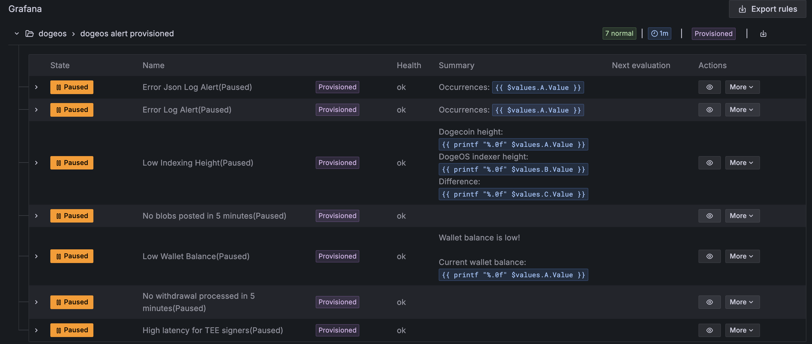
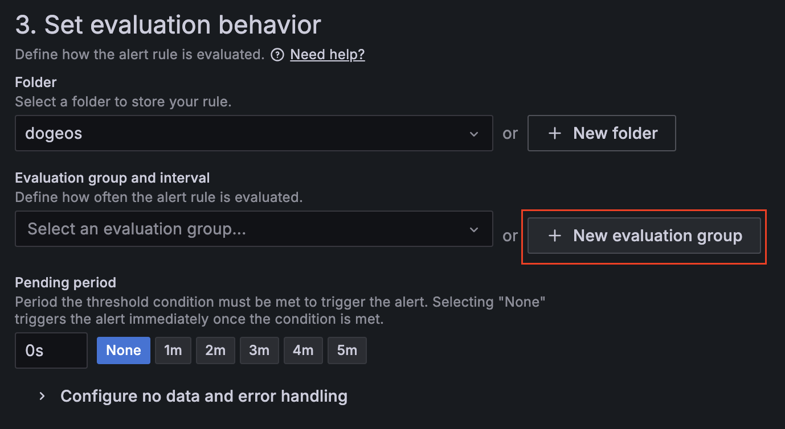
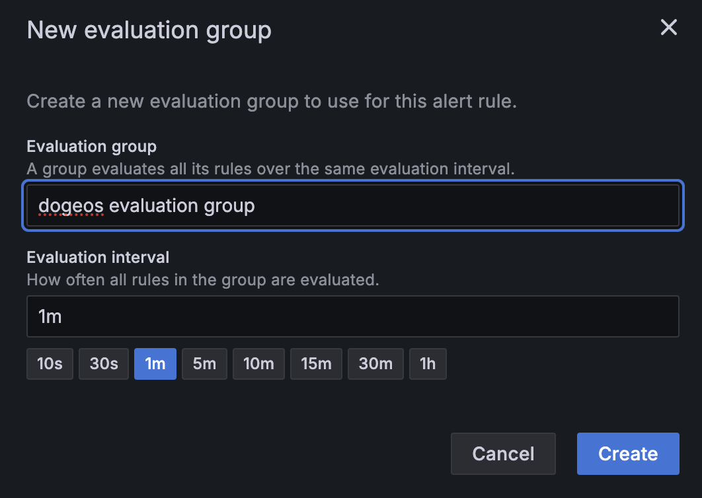
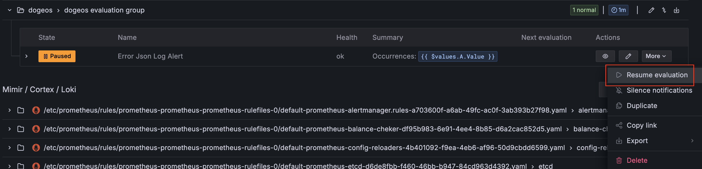

# AWS EKS Deployment Guide for DogeOS

This document provides comprehensive instructions for deploying DogeOS services in an AWS Elastic Kubernetes Service (EKS) cluster. It serves as a detailed reference for setting up and configuring all necessary components of the DogeOS infrastructure.


> **Prerequisite**: Please follow the official [AWS EKS Deployment](https://docs.scroll.io/en/sdk/guides/aws-deployment/) guide up to the [Setup your local repo](https://docs.scroll.io/en/sdk/guides/aws-deployment/#setup-your-local-repo) section. The following steps will build upon the initial cluster setup and configuration covered there.

## Table of Contents

1. [Setup your local deployment repository](#setup-your-local-deployment-repository)

1. [Copy files from `scroll-sdk/examples` folder](#copy-files-from-scroll-sdkexamples-folder)

1. [Create a Dogeos wallet](#create-a-dogeos-wallet)

1. [Setup Domains](#setup-domains)

1. [Database Initialization](#database-initialization)

1. [Generate Keystore Files](#generate-keystore-files)

1. [Config DogeOs Parameters](#config-dogeos-parameters)

1. [Setup dummy signers](#setup-dummy-signers)

1. [Initialize DogeOs Bridge](#initialize-dogeos-bridge)

1. [Generate Service Configuration Files](#generate-service-configuration-files)

1. [Prepare Helm Chart Configurations](#prepare-helm-chart-configurations)

1. [Refresh cubesigner session secrets](#refresh-cubesigner-session-secrets)

1. [Configure AWS Secrets Management](#configure-aws-secrets-management)

1. [Configure TLS and HTTPS](#configure-tls-and-https)

1. [DogeOs Deployment](#dogeos-deployment)

1. [Test After Deployment](#test-after-deployment)

1. [Verify Contracts](#verify-contracts)

1. [Re-Deployment from scratch](#re-deployment-from-scratch)

1. [Setting Up Grafana Alert Rules](#setting-up-grafana-alert-rules)


## Setup your local deployment repository

Create a directory for your project and initialize a git repository:

```bash
mkdir dogeos-aws-deploy && cd dogeos-aws-deploy && git init
```

## Copy files from `scroll-sdk/examples` folder

```bash
cp ../scroll-sdk/examples/config.toml.example ./config.toml
cp ../scroll-sdk/examples/Makefile.example ./Makefile
cp -r ../scroll-sdk/examples/values values
cp ../scroll-sdk/examples/anvil-fund-accounts.sh .
```

The `anvil-fund-accounts.sh` script funds the default L1 accounts when using an Anvil devnet.

## Create a Dogeos wallet
Execute the following command to create a new DogeOS wallet:

```bash
scrollsdk doge wallet new
```

During the wallet creation process, you will be prompted to:
1. Enter your nownodes.io API key
2. Select the network type

> **Important**: Securely store your generated private key, as it is the only credential required to access your wallet.


## Setup Domains
Execute the following command to configure domain settings:

```bash
scrollsdk setup domains
```

This command configures the ingress hosts and service URLs for:
- Frontend applications
- RPC services
- Other network endpoints

During the configuration process, you will be prompted to provide:
1. L1 Network Name
2. Chain ID
3. Domains

> **Note**: For devnet or testnet environments, you can use the default values provided by the system.


## Database Initialization

### Prerequisites
Follow the [AWS EKS Deployment](https://docs.scroll.io/en/sdk/guides/aws-deployment/#initializing-our-databases-and-database-users) guide to set up the AWS RDS service and prepare the database environment.

### Database Configuration
Execute the following command to initialize the database:

```bash
scrollsdk setup db-init
```

The initialization process requires two sets of database connection parameters:

1. External Connection
   - Used by public-facing services
   - Accessible from outside the cluster

2. Internal Connection
   - Used for inter-pod communication within Kubernetes
   - Optimized for cluster-internal access

> **Note**: 
> * The same connection parameters can be used for both external and internal connections if your setup permits.
> * Create appropriate database based on your service requirements, e.g. blockscout, L1 explorer

### Security Configuration
After successful database initialization, follow the [AWS EKS Deployment](https://docs.scroll.io/en/sdk/guides/aws-deployment/#initializing-our-databases-and-database-users) guide to:
1. Disable public access to the RDS instance
2. Configure appropriate security groups
3. Implement necessary access controls

> **Important**: This step is crucial for maintaining the security of your deployment.


## Generate Keystore Files

```
scrollsdk setup gen-keystore
```
### Purpose
This step generates essential cryptographic keys required for on-chain activities:
- Sequencer signer private keys
- Bootnode keys
- Owner Wallet private key for network administration
- Coordinator JWT secret key

### Key Generation
Execute the following command to generate the required keystore files:

```bash
scrollsdk setup gen-keystore
```

### Important Considerations
1. Sequencer Password
   - Provide a non-empty password when prompted
   - Empty passwords will cause deployment failures
   - The CLI tool does not validate password presence at this stage

2. Owner Wallet
   - Securely store the generated Owner Wallet private key
   - This key is critical for network administration

3. Coordinator JWT
   - Securely store the generated JWT secret key
   - Required for secure coordinator communication

> **Warning**: Failure to provide a valid sequencer password will result in the following error during deployment:
> ```
> err: key L2GETH_PASSWORD_0 does not exist in secret scroll/l2-sequencer-secret-env
> ```

## Config DogeOs Parameters
Execute the following command to configure essential DogeOS parameters:
```
scrollsdk doge config
```

This command configures the core settings required for DogeOS bridge and essential services. You will need to provide:

1. External Dogecoin RPC URL - for connecting to the Dogecoin network
2. RPC Authentication Credentials:
   - Username
   - Password
3. Celestia Tendermint RPC URL - for network communication and data availability

> **Note**: Ensure all provided URLs are accessible from your deployment environment and have the necessary permissions configured.

## Setup dummy signers
```
scrollsdk doge dummy-signers
```

## Initialize DogeOs Bridge
Before proceeding with the bridge initialization, ensure that the Docker daemon is running on the deployment machine.

Execute the following command to initialize the DogeOS bridge:

```bash
scrollsdk doge bridge-init
```

> **Note**: The initialization process involves multiple blockchain transactions and may take several minutes to complete. Please allow sufficient time for the process to finish.

> **Important**: During the bridge initialization process, if you encounter a log indicating insufficient funds for the `Helper Address`, you must:
> 1. Fund the displayed Helper Address with approximately 100 testnet DOGE
> 2. Re-run the initialization command using the `identical seed` value to maintain address consistency
>
> This step is crucial for the successful deployment of the bridge infrastructure.

```
? Enter the seed string abcdefg
Pulling Docker Image: docker.io/dogeos69/generate-test-keys:v0.1.1-test
Image pulled successfully
Creating Docker Container...
Starting Container
M--- Running Test Setup & Key Generation (with OP_RETURN bridge funding) ---
PLoading configuration from: "./crates/test_utils/config/setup_defaults.toml"...
'Starting setup for network: Testnet...
)Using RPC URL: https://testnet.doge.xyz/
:Using Blockbook URL: https://dogebook-testnet.nownodes.io
�2025-06-01T10:25:59.802847Z  INFO generate_test_keys: Using OP_RETURN payload (hex): 00bb8bc29695232088b1a2dbc117e8c6006478c295 for script (hex): 6a1500bb8bc29695232088b1a2dbc117e8c6006478c295
TDistribution Helper Address (derived from seed): ns2qzrycHLw9EbLarqkU4AFgWosH15WpJF
{2025-06-01T10:25:59.802919Z  INFO generate_test_keys: Initializing Dogecoin RPC client...
�2025-06-01T10:25:59.868387Z  INFO generate_test_keys: Checking funding for distribution helper address: ns2qzrycHLw9EbLarqkU4AFgWosH15WpJF
�2025-06-01T10:26:01.326648Z ERROR generate_test_keys: Distribution Helper address ns2qzrycHLw9EbLarqkU4AFgWosH15WpJF has no funds on testnet!

EPlease send some testnet DOGE to: ns2qzrycHLw9EbLarqkU4AFgWosH15WpJF
Then re-run this script.
...
...
```

## Generate Service Configuration Files

### Prerequisites
- Docker daemon must be running in the background
- `config.toml` file must be properly configured with required keys

### Configuration Generation
Execute the following command to generate service-specific configuration files and secrets:

```bash
scrollsdk setup configs
```

### Output Locations
The command will generate:
- Configuration files in the `./values` directory
- Secret files in the `./secrets` directory

### Configuration Parameters
The command will prompt for various configuration parameters. You can:
- Accept default values for most parameters
- Provide custom values for specific requirements

> **Note**: The generated configuration files will be used by various services in the deployment. Ensure all values are correctly set before proceeding with the deployment.


## Prepare Helm Chart Configurations

### Purpose
Execute the following command to prepare and validate Helm chart configurations:

```bash
scrollsdk setup prep-charts
```

### Process
This command performs two main functions:
1. Verifies chart accessibility
2. Updates production YAML files for all services

### Known Issue
During execution, you may encounter the following error:
> *Unable to access chart: blockscout-sc-verifier*

> **Note**: This error can be safely ignored as it does not affect the deployment process.

### Configuration Options
- Accept default values to complete the process
- Or maintain current configurations if specific customizations are required

> **Important**: Ensure all chart configurations are properly validated before proceeding with deployment.

## Refresh cubesigner session secrets

### Purpose
This command refreshes the CubeSigner session secrets that are required for secure key management and transaction signing operations.

### Refresh Session
Execute the following command to refresh the CubeSigner session secrets:

```
scrollsdk setup cubesigner-refresh
```

> **Note**: CubeSigner sessions have expiration periods for security purposes. Regular refresh ensures uninterrupted signing operations during deployment and runtime.

## Configure AWS Secrets Management

### Prerequisites
Follow the [AWS EKS Deployment](https://docs.scroll.io/en/sdk/guides/aws-deployment/#push-secrets) guide to:
1. Set up the required ServiceAccount
2. Create a SecretStore in AWS Secrets Manager

### Push Secrets to AWS
Execute the following command to begin the secret push process:

```bash
scrollsdk setup push-secrets
```

### Configuration Parameters
When prompted, provide the following information:
1. Secret Service: `AWS`
2. Secret Prefix Name: `dogeos`
3. AWS Secret Region: `us-west-2`
4. AWS Service Account: `external-secrets`

> **Important**: The service account name must match the one created in the prerequisite step.

### Process Flow
The command will:
1. Connect to AWS Secrets Manager
2. Push all generated secrets
3. Configure access permissions
4. Verify successful secret storage

> **Note**: 
> * Ensure you have the necessary AWS permissions and credentials configured before proceeding.
> * When generating new service secrets, ensure to overwrite existing secrets to maintain consistency and prevent potential conflicts in the deployment environment.

## Configure TLS and HTTPS

### Prerequisites
Follow the [AWS EKS Deployment](https://docs.scroll.io/en/sdk/guides/aws-deployment/#enable-tls--https) guide to:
1. Create a ClusterIssuer in Kubernetes
2. Configure certificate management for your cluster

### Enable TLS
Execute the following command to configure TLS for your services:

```bash
scrollsdk setup tls
```

### Process
This command will:
1. Update all production YAML files
2. Configure TLS settings for external hostnames
3. Enable HTTPS for all exposed services

> **Note**: The TLS configuration is essential for securing external communications and enabling HTTPS access to your services.

> **Important**: Ensure your domain DNS records are properly configured before enabling TLS.

<br/><br/>

> Please refer to the official AWS deployment guide for the remaining configuration steps up to the Deployment section. 

## DogeOs Deployment

### 1. Deploy `dogecoin` node
```bash
make install-dogecoin
```

### 2. Deploy `celestia` node
```bash
make install-celestia
```

### 3. Deploy `l1-devnet`

```bash
make install-l1-devnet
```

#### 3.1. Fund the Deployer

```bash
scrollsdk helper fund-accounts -i -f 2 -d
scrollsdk helper fund-accounts -l 1 -f 2 -d
```

### 4. Deploy Scroll Core Services

Execute the following command to deploy the core scroll services:

```bash
make install-scroll-core
```

#### Components Deployed
The deployment process installs the following core components:
* Core Infrastructure
   - Sequencer
   - Bootnode
   - L2 RPC services

* Monitoring Stack
   - Scroll monitoring services
   - Grafana Alloy for log/metrics collection
   - Metrics Exporter to create metrics from http calls

#### Deployment Verification
Monitor the deployment progress using either:
- `kubectl get pods -n <namespace>`
- The recommended `k9s` terminal UI tool

> **Important**: Verify successful deployment by ensuring all pods transition to the "Running" state without any error conditions.

> **Note**: The deployment process may take several minutes to complete. Allow sufficient time for all components to initialize properly.


### 5. Deploy contracts

```bash
make install-contracts
```
> Note: Contract deployment requires sufficient funds in the deployer account. If the account balance was insufficient during initial deployment, you may need to redeploy the contracts after funding the account in `step 3.1`.


### 6. Deploy Dogeos DA service
```bash
make install-dogeos-da
```

### 7. Deploy rollup node and explorer
```bash
make install-rollup-node
```

### 8. Deploy Gas Oracle
```bash
make install-gas-oracle
```
We need to fund our L1 Gas Oracle Sender (an account on L2 😅) with some funds.

```bash
scrollsdk helper fund-accounts -f 0.2 -l 2
```

When prompted, select the `Directly fund L2 wallet` option to complete the transfer.

### 9. Deploy Dogeos Deposit Processor
```bash
make install-deposit-processor
```

### 10. Deploy Cubesigner Signers
```bash
make install-cubesigner-signers
```

### 11. Deploy TSO service
```bash
make install-tso
```

### 12. Deploy Withdrawal Processor
```bash
make install-withdrawal-processor
```

### 13. Deploy Blockscout services
```bash
make install-blockscout
```
The script will install:
- Blockscout stack and  explorer
- Smart contract verification service


### 14. Deploy Frontends
```bash
make install-frontends
```

## Test After Deployment

After all the required services are deployed successfully, run the following test commands:

```bash
scrollsdk test ingress
scrollsdk test contracts
```

</br>

## Verify Contracts

### 1. Check Contract Verification Parameters

```toml
[contracts.verification]
VERIFIER_TYPE_L1 = "blockscout"
VERIFIER_TYPE_L2 = "blockscout"
EXPLORER_URI_L1 = "https://blockscout.scrollsdk.<your domain>"
EXPLORER_URI_L2 = "https://blockscout.scrollsdk.<your domain>"
RPC_URI_L1 = "https://l1-devnet.scrollsdk.<your domain>"
RPC_URI_L2 = "https://l2-rpc.scrollsdk.<your domain>"
EXPLORER_API_KEY_L1 = ""
EXPLORER_API_KEY_L2 = ""
```
> Note:
> - Remove the leading space if any
> - Ensure all URI addresses are correctly configured and replace `<your domain>` with your actual domain name.


### 2. Configure Chain IDs

In the `config.toml` file, ensure chain IDs are in the correct numeric format:

```yaml
CHAIN_ID_L1 = 31337
CHAIN_ID_L2 = 221122
```

> Important: Chain IDs must be in pure numeric format without quotes or underscores.

### 3. Execute Contract Verification

Run the following command to verify contracts:

```bash
scrollsdk setup verify-contracts
```

> Important Notes:
> - Contract verification can only be performed successfully once, all the consequent verification will fail after that.
> - If contracts are required to be verified again, blockscout database must be deleted and blockscout/blockscout-sc-verifier services must be redeployed.
> - After successful verification, results can be viewed in the Blockscout explorer
> - There is a known issue in blockscout explorer which won't update the number of the verified contracts, reployment of blockscout services will fix the issue.

</br>

## Re-Deployment from scratch
### Delete all charts and release all resources
```bash
# delete all charts
make delete-all
# Caution: release all persistent volume associated with services
kubectl delete pvc --all
```

</br>

</br>

# Setting Up Grafana Alert Rules

After installation, Grafana comes with several pre-configured alert rules. These provisioned alerts are in a read-only state and paused by default.



## Enabling Alert Rules

To enable and customize these alert rules, follow these steps:

1. **Duplicate the Rule**
   - Click the `More` menu
   - Select `Duplicate`
   - Rename the alert rule, removing the `(Paused) (copy)` suffix

2. **Configure Evaluation Behavior**
   - Navigate to the `Set evaluation behavior` section
   - Click `create a new evaluation group`
   
   
   
   

   > Note: The evaluation group only needs to be created once and can be reused for multiple alert rules.

3. **Save and Enable**
   - Save the modified rule
   - Resume the alert rule to activate it
   
   

4. **Repeat Process**
   - Follow steps 1-3 for each alert rule you wish to enable

This process allows you to customize and activate the pre-configured alert rules while maintaining their core functionality.
