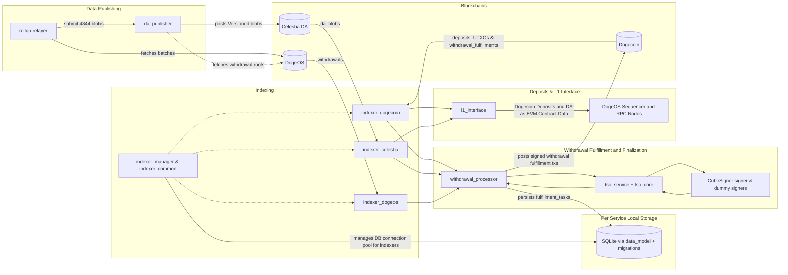

# DogeOS Core

[](CHANGELOG.md)
[](https://www.rust-lang.org)
[](LICENSE)

> The following documentation is a work in progress and awaiting final review.

## Overview
DogeOS Core bridges Dogecoin basechain activity with an EVM-compatable application layer by indexing on-chain data, orchestrating withdrawal transactions, publishing data-availability blobs to Celestia, and exposing Ethereum-compatible RPC surfaces compatable with Scroll's zkEVM services. This workspace collects every service, tool, and shared library required to run the bridge end-to-end.

**Current Version:** 0.2.0 | [Changelog](CHANGELOG.md) | [Contributing Guide](CONTRIBUTING.md)

## Repository Layout
- `crates/` – Rust crates containing the indexers, withdrawal processor, TSO service/core, shared utilities, and supporting tooling.
- `go-tools/da-codec-cli/` – Go CLI used for Scroll blob decoding and genesis hash computation that complements the Rust `da_codec` crate.
  - _Only genesis hash computation is used in production after v0.2.0_
- `ts-packages/cubesigner-signer/` – TypeScript service that connects CubeSigner to the TSO attestation phase using CubeSigner SDK.
- `migrations/` – Diesel migrations that define the shared SQLite schema consumed by all Rust services.
- `scripts/` – Workspace helper scripts (`format-and-lint.sh`, dummy signer bootstrap) and operational tooling.

## Quickstart
### Prerequisites
- Rust toolchain `1.91.0` (pinned in `rust-toolchain.toml`) with `cargo`, `rustfmt`, `clippy`, and Diesel CLI (`cargo install diesel_cli --no-default-features --features sqlite`).
- Go `1.23.2` (see `go-tools/da-codec-cli/go.mod`).
- Node.js `>=16` with `npm` for the CubeSigner delegate (`ts-packages/cubesigner-signer`).
- SQLite 3.40+ (Diesel migrations target SQLite WAL mode).
- Optional: `cargo-llvm-cov` for coverage (`cargo install cargo-llvm-cov`).
  - _TBD on how/if this works atm._

### Bootstrap the workspace
1. Install toolchains (`rustup toolchain install 1.91.0`, `brew install go node sqlite`, etc.).
2. Fetch dependencies and compile the Rust crates:
   ```bash
   cargo build
   ```
3. Build and test the DA codec CLI:
   ```bash
   make go        # runs go test and builds bin/da-codec-cli
   ```
4. Install TypeScript dependencies:
   ```bash
   (cd ts-packages/cubesigner-signer && npm install)
   ```
5. Apply database migrations when running services locally (_TBD if this is recommended_):
   ```bash
   diesel migration run --database-url sqlite://./dev.db
   ```

### Running core services locally
Although orchestration of services is complicated locally and best done using Helm and k8s, it can be useful for testing. Copy configuration templates from the relevant crates before running (for example `cp crates/withdrawal_processor/config/example.toml WithdrawalProcessor.toml` and `cp crates/l1_interface/config/local-test.toml L1Interface.toml`); compose `DogecoinIndexerRunner.toml` from the sample in `crates/indexer_manager/README.md`.

- **Indexer manager harness** (runs orchestrated sync against sample config):
  ```bash
  cargo run -p indexer_manager --bin indexer_manager_test -- \
    --database ./crates/indexer_manager/test_indexer_manager.db \
    --config DogecoinIndexerRunner.toml --continuous
  ```
  The harness mirrors production startup of actual service (embedded migrations, pooled SQLite, supervised indexers) and is safe to run locally. In production, services embed the `indexer_manager` library rather than utilizing the standalone binary.
- **Withdrawal processor** (batching + fulfillment):
  ```bash
  cargo run -p withdrawal_processor -- --config WithdrawalProcessor.toml
  ```
- **TSO service** (Transaction Signature Orchestrator API):
  ```bash
  cargo run -p tso_service -- --port 3001 --network testnet --withdrawal-processor-url http://127.0.0.1:8080
  ```
- **CubeSigner Signer** (TypeScript):
  ```bash
  npm run --prefix ts-packages/cubesigner-signer dev -- \
    --port 4001 --tso-url http://127.0.0.1:3001 \
    --cs-key-id Key#example --cs-session-path ./session.json
  ```
- **DA publisher**:
  ```bash
  cargo run -p da_publisher -- --config crates/da_publisher/config.toml
  ```
- **L1 interface** (Ethereum-compatible RPC layer):
  ```bash
  cargo run -p l1_interface -- --config L1Interface.toml
  ```

Use the provided `*.toml` templates as starting points for configuration.

## Component Map
- Architecture overview: [ARCHITECTURE.md](ARCHITECTURE.md)
- Service and library index: [COMPONENT_GUIDE.md](COMPONENT_GUIDE.md)
- Development workflow: [DEVELOPMENT.md](DEVELOPMENT.md)
- Testing strategy: [TESTING.md](TESTING.md)
- Configuration reference: [CONFIGURATION.md](CONFIGURATION.md)
- Database schema summary: [DATABASE.md](DATABASE.md)

Refer to crate-level documentation for implementation details—for example the README files for [withdrawal_processor](crates/withdrawal_processor/README.md), [indexer_manager](crates/indexer_manager/README.md), [tso_service](crates/tso_service/README.md), and [da_publisher](crates/da_publisher/README.md).

## Architecture at a Glance


## Configuration & Schema Assets
For detailed configuration, operational, and security guidance see the linked documents above.
